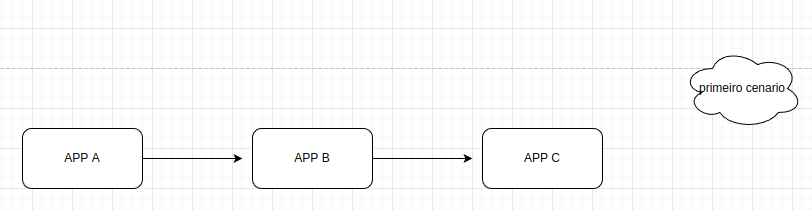
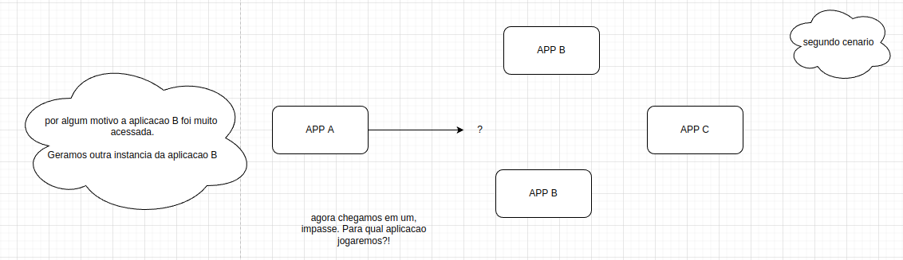

### Cenario comum em aplicacoes distribuidas

1 - Primeiro cenario

  

2 - Segundo cenario

  

  - 2.1 Perguntas a se fazer
    - Qual maquina chamar?
    - Qual porta utilizar
    - Preciso saber o IP de cada instancia?
    - Como tercerteza se aquela instancia esta saudavel?
    - Como saber se tenho permissao para acessar

### Service Discovery

- Para que serve?!
  - Descobre as maquinas disponiveis para acesso
  - Segmentacao de maquinas para garantir seguranca
  - Resolucoes via DNS
  - Health Check
  - Como saber se tenho permissao para acessar

### Hashicorp Consul

- Service Discovery
- Service Segmentation
- Load Balancer na Borda (Layer 7)
- Key/Value Configuration
- Opensource / Enterprise