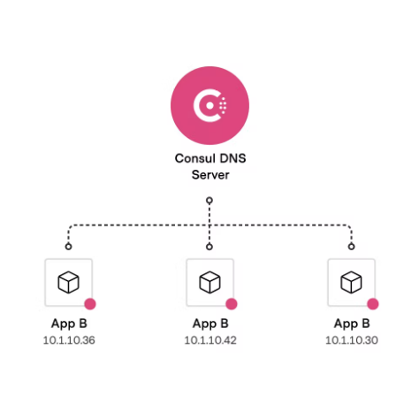

### Cenario comum em aplicacoes distribuidas

1 - Primeiro cenario

<p align="center">
  
</p>

2 - Segundo cenario

<p align="center">
  
</p>

  - 2.1 Perguntas a se fazer
    - Qual maquina chamar?
    - Qual porta utilizar
    - Preciso saber o IP de cada instancia?
    - Como tercerteza se aquela instancia esta saudavel?
    - Como saber se tenho permissao para acessar

### Service Discovery

- Para que serve?!
  - Descobre as maquinas disponiveis para acesso
  - Segmentacao de maquinas para garantir seguranca
  - Resolucoes via DNS
  - Health Check
  - Como saber se tenho permissao para acessar

### Hashicorp Consul

- Service Discovery
- Service Segmentation
- Load Balancer na Borda (Layer 7)
- Key/Value Configuration
- Opensource / Enterprise

### Consul & Service Registry Centralizado

<p align="center">
  
</p>

## Como utilizar consul?!

- 1 subir o container `docker-compose up -d`

- 2  iniciar o agent:
  - 2.1 acessar o container: `docker exec -it consul_01 sh`
  - 2.2 iniciar o agent: `consul agent -dev` 
    - exemplo:
    ```
    ==> Starting Consul agent...
           Version: '1.10.11'
           Node ID: 'd279ae34-e387-4139-6d10-561fbd674d39'
         Node name: 'consul_01'
        Datacenter: 'dc1' (Segment: '<all>')
            Server: true (Bootstrap: false)
       Client Addr: [127.0.0.1] (HTTP: 8500, HTTPS: -1, gRPC: 8502, DNS: 8600)
      Cluster Addr: 127.0.0.1 (LAN: 8301, WAN: 8302)
           Encrypt: Gossip: false, TLS-Outgoing: false, TLS-Incoming: false, Auto-Encrypt-TLS: false

    ==> Log data will now stream in as it occurs:
    ```
  - 2.3 visualizar os agents: `consul members`
    ```
    Node       Address         Status  Type    Build    Protocol  DC   Segment
    consul_01  127.0.0.1:8301  alive   server  1.10.11  2         dc1  <all>
    ```
  - 2.4 visualizar os nodes: `curl localhost:8500/v1/catalog/nodes`
    ```
    [
      {
          "ID": "d279ae34-e387-4139-6d10-561fbd674d39",
          "Node": "consul_01",
          "Address": "127.0.0.1",
          "Datacenter": "dc1",
          "TaggedAddresses": {
              "lan": "127.0.0.1",
              "lan_ipv4": "127.0.0.1",
              "wan": "127.0.0.1",
              "wan_ipv4": "127.0.0.1"
          },
          "Meta": {
              "consul-network-segment": ""
          },
          "CreateIndex": 11,
          "ModifyIndex": 12
      }
    ]
    ```
    - 2.5 instalar dig no `linux alpine`
      - 2.5.1 `apk -U add bind-tools`
      - 2.5.2 acessando o dig no localhost: `dig @localhost -p 8600`
      ```
      ; <<>> DiG 9.16.29 <<>> @localhost -p 8600
      ; (1 server found)
      ;; global options: +cmd
      ;; Got answer:
      ;; ->>HEADER<<- opcode: QUERY, status: REFUSED, id: 31821
      ;; flags: qr rd; QUERY: 1, ANSWER: 0, AUTHORITY: 0, ADDITIONAL: 0
      ;; WARNING: recursion requested but not available

      ;; QUESTION SECTION:
      ;.                              IN      NS

      ;; Query time: 0 msec
      ;; SERVER: 127.0.0.1#8600(127.0.0.1)
      ;; WHEN: Mon Jun 06 17:33:44 UTC 2022
      ;; MSG SIZE  rcvd: 17
      ```
    - 2.5.3 buscando todos os nodes com os ips: `dig @localhost -p 8600 consul_01.node.consul`
    ```
    ; <<>> DiG 9.16.29 <<>> @localhost -p 8600 consul_01.node.consul
    ; (1 server found)
    ;; global options: +cmd
    ;; Got answer:
    ;; ->>HEADER<<- opcode: QUERY, status: NOERROR, id: 18617
    ;; flags: qr aa rd; QUERY: 1, ANSWER: 1, AUTHORITY: 0, ADDITIONAL: 2
    ;; WARNING: recursion requested but not available

    ;; OPT PSEUDOSECTION:
    ; EDNS: version: 0, flags:; udp: 4096
    ;; QUESTION SECTION:
    ;consul_01.node.consul.         IN      A

    ;; ANSWER SECTION:
    consul_01.node.consul.  0       IN      A       127.0.0.1

    ;; ADDITIONAL SECTION:
    consul_01.node.consul.  0       IN      TXT     "consul-network-segment="

    ;; Query time: 0 msec
    ;; SERVER: 127.0.0.1#8600(127.0.0.1)
    ;; WHEN: Mon Jun 06 17:35:02 UTC 2022
    ;; MSG SIZE  rcvd: 102
    ```
- 3 para rodar cada server, primeiro precisamos saber o ip do docker `ifconfig` e rodarmos o server: `consul agent -server -bootstrap-expect=3 -node=consulserver_01 -bind=172.23.0.2 -data-dir=/var/lib/consul -config-dir=/etc/consul.d`
  - 3.1 verificando os members: `consul members`
  - 3.2 fazer a comunicacao no segundo server: `consul join 172.23.0.2`

- 4 rodar o agent: `consul agent -config-dir=/etc/consul.d`